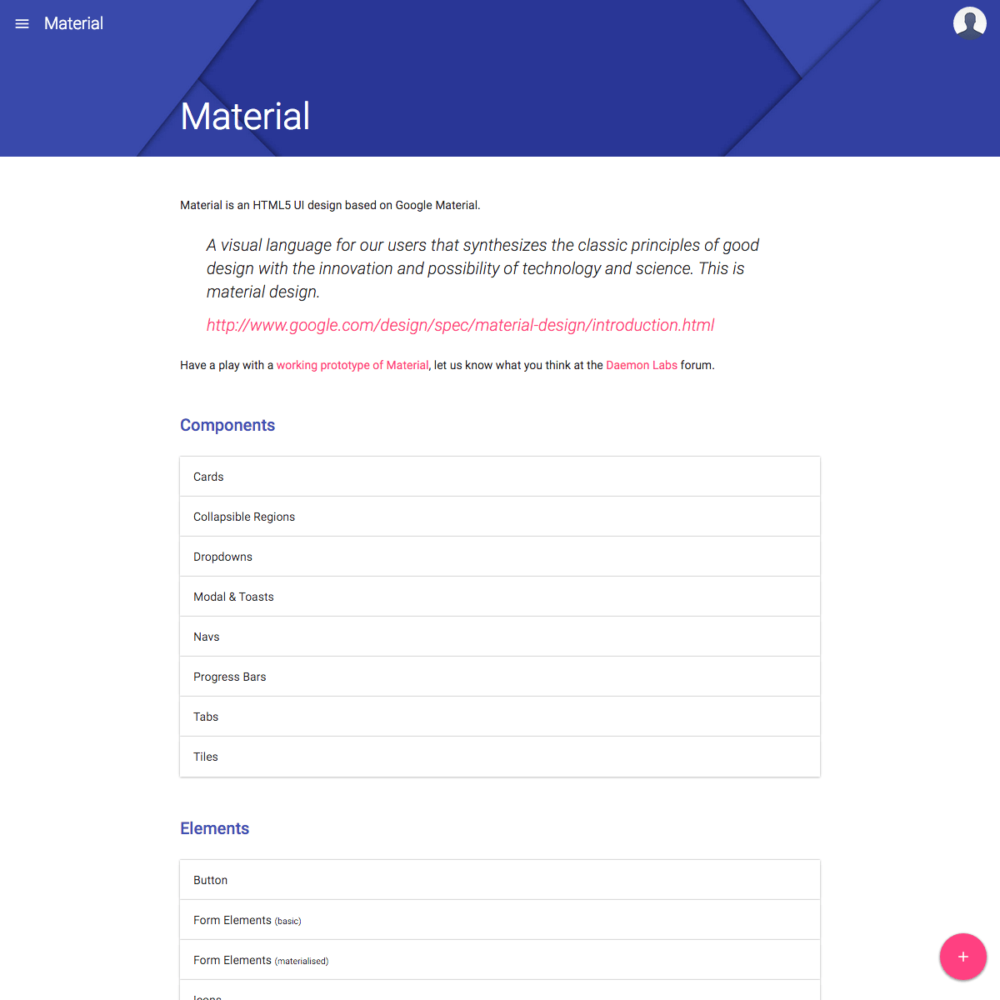

# Material

iZapper Material UI is a fully responsive, cross-platform, front-end interface based on Google Material Design. This lightweight framework is built in HTML5 using Bootstrap, JS and CSS.

> a visual language for our users that synthesizes the classic principles of good design with the innovation and possibility of technology and science. This is material design.
> http://www.google.com/design/spec/material-design/introduction.html

Enjoy !!!
